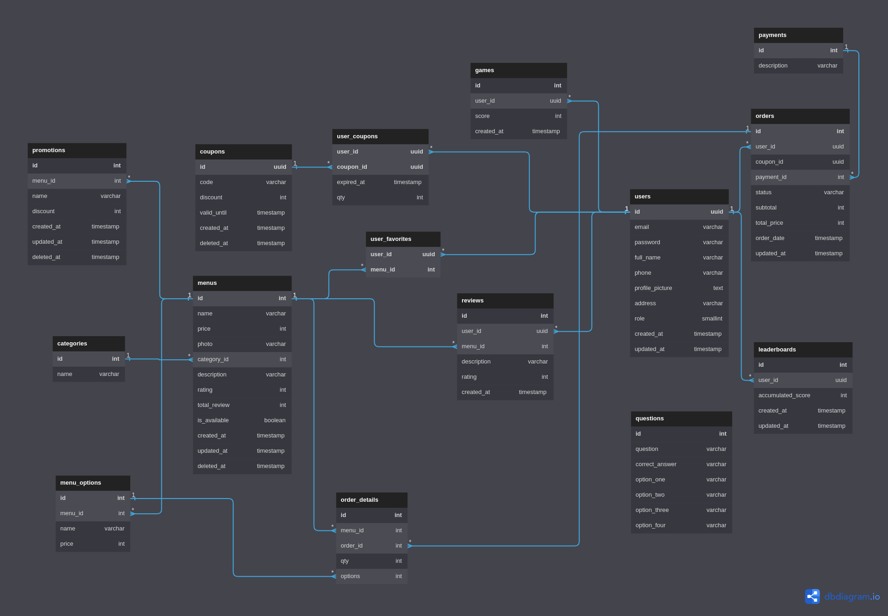

# Project Setup Instructions:

To setup the project, follow these steps:

1. To set up the database, execute the provided SQL file (`assets/db.sql`). This will create the necessary tables and populate them with dummy data.
2. Configure your environment settings in the `application.yml` file.
3. Access the documentation through `localhost:8080/docs`.
4. Run `go mod init` to install the project dependencies.

Note: The default password for the user in the dummy data is 1234.

# Running Instructions:

To run the project, follow these steps:

1. Ensure that Go is installed on your system.
2. In your terminal, run the command `make run` or `go run main.go`.
3. Open your browser and go to `localhost:8080/docs` to check if the project is running.

If you see the documentation on your browser, then the project is running successfully.

# Entity-Relationship Diagram (ERD)



# Pagination

You can filter the results of a pagination request by using the following parameters:

1. Sort By

Menus: You can sort the results by date, price, name, or rating. The default sort order is by rating.

For example, to sort the menus by date, you would use the following URL:

```
/menus?sortBy=date
```

Orders: You can sort the results by order_date or total_price. The default sort order is by order_date.

For example, to sort the orders by order date, you would use the following URL:

```
/users/orders?sortBy=order_date
```

2. Sort

To sort the list, use the `sort` query parameter. The default sorting order is `desc`, but you can use `asc` to sort in ascending order.

For example, to sort the menus list in ascending order by name, you would use the following URL:

```
/menus?sort=asc
```

3. Search

To search the list, use the `name` query parameter.

For example, to search for all menus with the name **"Iced"**, you would use the following URL:

```
/menus?name=Iced
```

4. Limit and Page

To limit the number of results, use the `limit` and `page` query parameters. The default limit is 10, and the default page is 1.

For example, to get the first 5 menus on page 2, you would use the following URL:

```
/menus?limit=5&page=2
```

Note: You can combine all of these filters together.

For example, to get all menus with the name **"Iced"** that are on page 2, you would use the following URL:

```
/menus?name=Iced&limit=5&page=2
```
