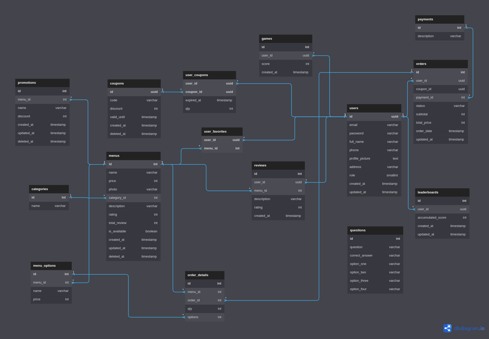

# Final Project

## Theme: Restaurant

## How to Setup:

1. To setup database, please run the given SQL file (you can find it in the `assets/final-project.sql`) in the SQL client software application (e.g Dbeaver) to set up tables and dummy data.
2. You can setup your environment settings in the `application.yml`.
3. Documentation may be accessed through `localhost:8080/docs`.
4. [Optional] If you want, you can import postman collection (you can find it in the `assets/final-project.postman_collection.json`)
5. Run `go mod init` to install dependencies

Note: Default password for user in dummy data is 1234

## How to Run:

1. Make sure you have installed Go.
2. Run `make run` or `go run main.go` in your terminal.
3. Try to access `localhost:8080/docs` in your browser to check if it is already running.

## ERD



## Pagination

For pagination, there is some filters that you can use:

1. Sort By

```
For menu, you can sort by date, price, name, and rating (default by rating)
e.g /menus?sortBy=date

For order, you can sort by order_date and total_price (default by order_date)
e.g /users/orders?sortBy=order_date
```

2. Sort

```
You can sort list of menu and order descending or ascending (default descending)
e.g /menus?sort=asc
```

3. Search

```
You can search menu and order by menu name
e.g /menus?name=Iced
```

4. Limit and Page

```
You can set limit for pagination and page to jump into desired page (default limit 10)
e.g /menus?limit=5&page=2
```

Note: you can combined all the filters together

More details in postman collection
